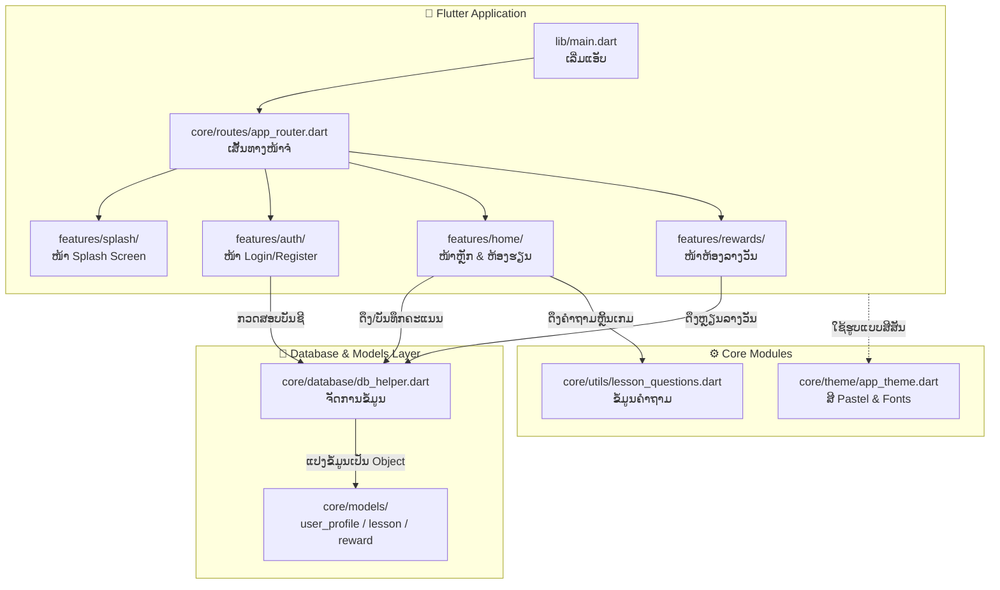

# 📂 ຄູ່ມືໂຄງສ້າງໂຟນເດີ ແລະ ໜ້າທີ່ຂອງແຕ່ລະສ່ວນ (Project Structure Guide)

ໄຟລ໌ນີ້ອະທິບາຍກ່ຽວກັບໂຄງສ້າງໂຟນເດີຂອງແອັບ **app_book** ວ່າແຕ່ລະໂຟນເດີ ແລະ ໄຟລ໌ມີໜ້າທີ່ຫຍັງແດ່ ເພື່ອໃຫ້ງ່າຍຕໍ່ການພັດທະນາ ແລະ ແກ້ໄຂໂຄ້ດ.

---

## 🗺️ ແຜນວາດສະຖາປັດຕະຍະກຳ ແລະ ຄວາມສຳພັນ (Architecture Diagram)

ແຜນວາດນີ້ສະແດງໃຫ້ເຫັນວ່າແຕ່ລະໂຟນເດີ/ໄຟລ໌ໃນແອັບພລິເຄຊັນ ສື່ສານ ແລະ ເຮັດວຽກຮ່ວມກັນແນວໃດ:

---

## 📁 ໂຄງສ້າງໂຟນເດີຫຼັກ (Root Directory)

*   **`android/`**: ໂຟນເດີເກັບໂຄ້ດສະເພາະຂອງລະບົບປະຕິບັດການ Android (ເຊັ່ນ: ການກຳນົດສິດການເຂົ້າເຖິງອິນເຕີເນັດ, ຕັ້ງຄ່າເວີຊັນ Android, ຮູບໄອຄອນແອັບໃນ Android).
*   **`ios/`**: ໂຟນເດີເກັບໂຄ້ດສະເພາະຂອງ iOS (ສຳລັບນຳໃຊ້ໃນເຄື່ອງ Mac).
*   **`assets/`**: ໂຟນເດີເກັບໄຟລ໌ພາຍນອກ ເຊັ່ນ: ຮູບພາບ (`assets/images/app_logo.png`) ທີ່ໃຊ້ສະແດງໃນແອັບ.
*   **`pubspec.yaml`**: ໄຟລ໌ທີ່ສຳຄັນທີ່ສຸດໃນການຕັ້ງຄ່າໂຄງການ. ໃຊ້ເພື່ອກຳນົດເວີຊັນຂອງແອັບ, ຕິດຕັ້ງ Packages/Libraries ເພີ່ມເຕີມ (ເຊັ່ນ: `go_router`, `flutter_animate`, `audioplayers`) ແລະ ປະກາດນຳໃຊ້ຮູບພາບ ຫຼື ຟອນ (Fonts).
*   **`lib/`**: ໂຟນເດີຫຼັກທີ່ເກັບໂຄ້ດ Dart ທັງໝົດຂອງແອັບພລິເຄຊັນ ທີ່ພວກເຮົາຈະຂຽນ ແລະ ແກ້ໄຂເປັນຫຼັກ.

---

## 📁 ລາຍລະອຽດພາຍໃນໂຟນເດີ `lib/`

ໂຄງສ້າງພາຍໃນ `lib/` ຖືກອອກແບບແບບ **Feature-First Architecture** (ແບ່ງຕາມຄຸນສົມບັດການນຳໃຊ້):

### 1. `lib/main.dart`
*   **ໜ້າທີ່**: ເປັນຈຸດເລີ່ມຕົ້ນ (Entry Point) ຂອງແອັບພລິເຄຊັນ. ເມື່ອເປີດແອັບ, ລະບົບຈະມາອ່ານ ແລະ ເລີ່ມເຮັດວຽກຈາກໄຟລ໌ນີ້ກ່ອນໝູ່.

### 2. `lib/core/` (ສ່ວນແກ່ນກາງທີ່ທຸກສ່ວນເອີ້ນໃຊ້ຮ່ວມກັນ)
*   **`core/database/db_helper.dart`**: ຄຸ້ມຄອງ ແລະ ຕິດຕໍ່ຖານຂໍ້ມູນ. ຈັດການການເຊື່ອມຕໍ່ກັບ API MySQL (XAMPP Server) ແລະ SQLite (ຖານຂໍ້ມູນໃນເຄື່ອງ). ມີຟັງຊັນບັນທຶກຄະແນນ, ດຶງຂໍ້ມູນບົດຮຽນ, ລາງວັນ ແລະ ຂໍ້ມູນຜູ້ໃຊ້.
*   **`core/models/`**: ເກັບໂຄງສ້າງຂໍ້ມູນ (Data Models) ເພື່ອແປງຂໍ້ມູນຈາກຖານຂໍ້ມູນໃຫ້ເປັນ Object ໃນພາສາ Dart:
    *   `user_profile.dart`: ໂຄງສ້າງຂໍ້ມູນໂປຣໄຟລ໌ຂອງຫຼານນ້ອຍ (ຊື່, ເບີໂທ, ລະຫັດຜ່ານ, ຄະແນນ).
    *   `lesson.dart`: ໂຄງສ້າງຂໍ້ມູນບົດຮຽນ (ຫົວຂໍ້ບົດຮຽນ, ວິຊາ, ຂັ້ນຮຽນ, ຈຳນວນດາວ).
    *   `reward.dart`: ໂຄງສ້າງຂໍ້ມູນລາງວັນ (ຊື່ລາງວັນ, ໄອຄອນ/Emoji, ສະຖານະການປົດລັອກ).
*   **`core/routes/app_router.dart`**: ກຳນົດເສັ້ນທາງການປ່ຽນໜ້າຈໍ (Navigation/Routing) ຂອງແອັບທັງໝົດ ໂດຍໃຊ້ `GoRouter`.
*   **`core/theme/app_theme.dart`**: ກຳນົດຮູບແບບຄວາມສວຍງາມຂອງແອັບ ເຊັ່ນ: ໂທນສີ (Pastel Colors), ຂະໜາດໂຕໜັງສື ແລະ Font (Noto Sans Lao).
*   **`core/utils/`**: ເກັບໄຟລ໌ຊ່ວຍເຫຼືອທົ່ວໄປ:
    *   `lesson_questions.dart`: ຂໍ້ມູນຄຳຖາມ-ຄຳຕອບ ຂອງແຕ່ລະບົດຮຽນທັງໝົດໃນແອັບ.

### 3. `lib/features/` (ແບ່ງແຕ່ລະໜ້າຈໍ ແລະ ຄຸນສົມບັດຂອງແອັບ)
*   **`features/splash/`**:
    *   `splash_screen.dart`: ໜ້າຈໍທຳອິດທີ່ສະແດງໂລໂກ້ແອັບພ້ອມອະນິເມຊັນເຄື່ອນໄຫວ (Splash Screen) ກ່ອນຈະເຂົ້າສູ່ໜ້າຫຼັກ.
*   **`features/auth/`** (ຈັດການລະບົບບັນຊີຜູ້ໃຊ້):
    *   `login_screen.dart`: ໜ້າເຂົ້າສູ່ລະບົບດ້ວຍຊື່ ຫຼື ເບີໂທ ແລະ ລະຫັດຜ່ານ. ພ້ອມທັງມີສ່ວນຕັ້ງຄ່າ IP ຂອງ MySQL Server.
    *   `add_profile_screen.dart`: ໜ້າລົງທະບຽນສ້າງບັນຊີໃໝ່ໃຫ້ຫຼານນ້ອຍ.
    *   `edit_profile_screen.dart`: ໜ້າແກ້ໄຂຂໍ້ມູນບັນຊີ ຫຼື ລຶບບັນຊີຜູ້ໃຊ້.
*   **`features/home/`** (ສ່ວນໜ້າຫຼັກ ແລະ ການຮຽນ):
    *   `home_screen.dart`: ໜ້າຫຼັກຂອງແອັບ ມີ 3 ແຖບເມນູລຸ່ມ (ຫ້ອງຮຽນ ປ.1/ປ.2, ຫ້ອງລາງວັນ, ຂໍ້ມູນຜູ້ພັດທະນາ).
    *   `subject_selection_screen.dart`: ໜ້າເລືອກວິຊາຮຽນ (ພາສາລາວ ຫຼື ຄະນິດສາດ).
    *   `student_lessons_screen.dart`: ໜ້າສະແດງລາຍຊື່ບົດຮຽນ ແລະ ສະຖານະດາວທີ່ຫຼານນ້ອຍໄດ້ຮັບ.
    *   `lesson_play_screen.dart`: ໜ້າຫຼິ້ນ ແລະ ຮຽນບົດຮຽນ (ມີທັງໂໝດຝຶກອ່ານ ແລະ ຕອບຄຳຖາມ MCQ).
    *   `developer_info_body.dart`: ໜ້າສະແດງຂໍ້ມູນຕິດຕໍ່ຂອງຜູ້ພັດທະນາແອັບ.
*   **`features/rewards/`**:
    *   `reward_room_screen.dart`: ໜ້າຫ້ອງສະສົມລາງວັນ ສະແດງຫຼຽນກຽດຕິຍົດຕ່າງໆ ທີ່ຫຼານນ້ອຍປົດລັອກໄດ້ຈາກການສະສົມດາວ.
