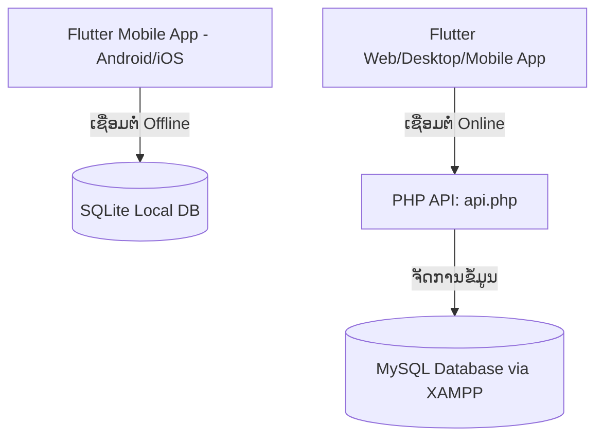
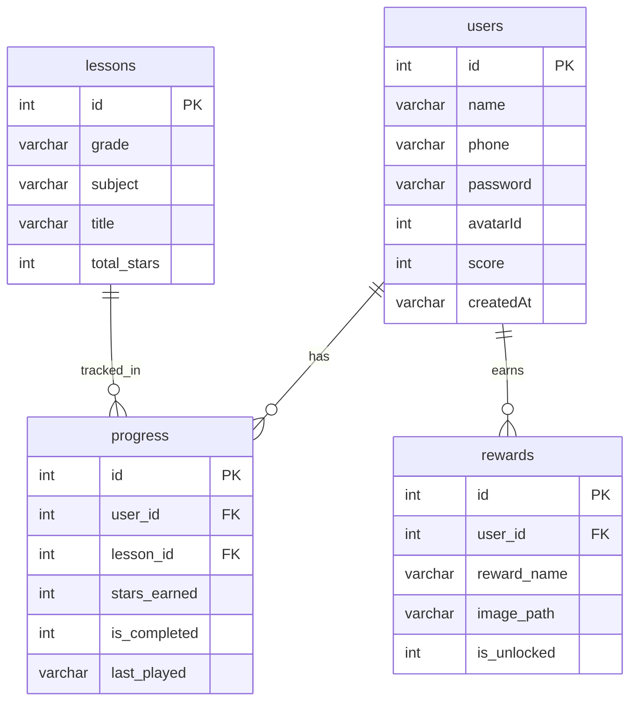
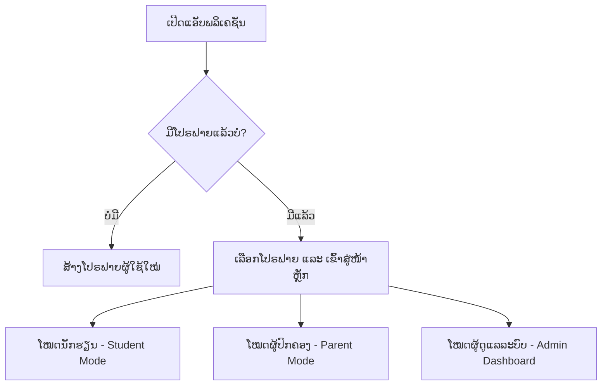

# ເອກະສານອະທິບາຍລະບົບຖານຂໍ້ມູນ, ເບື້ອງຫຼັງ (Backend) ແລະ ການນຳໃຊ້ແອັບພລິເຄຊັນ
---

ເອກະສານສະບັບນີ້ຖືກຈັດເຮັດຂຶ້ນເພື່ອອະທິບາຍໂຄງສ້າງລະບົບ, ຖານຂໍ້ມູນ, ສ່ວນເບື້ອງຫຼັງ (Backend), ແລະ ຂັ້ນຕອນການນຳໃຊ້ແອັບພລິເຄຊັນ **Edu App (ແອັບພລິເຄຊັນຮຽນຮູ້ສຳລັບເດັກນ້ອຍ ປ.1 ແລະ ປ.2)** ເພື່ອອຳນວຍຄວາມສະດວກໃນການປ້ອງກັນບົດ ຫຼື ຕອບຄຳຖາມຂອງຄູ-ອາຈານ.

---

## 1. ພາບລວມສະຖາປັດຕະຍະກຳຂອງລະບົບ (System Architecture)

ແອັບພລິເຄຊັນນີ້ຖືກອອກແບບໃຫ້ມີຄວາມຢືດຢຸ່ນສູງ (Hybrid Database System) ເພື່ອຮອງຮັບທັງການຫຼິ້ນແບບບໍ່ມີອິນເຕີເນັດ (Offline) ແລະ ແບບອອນລາຍ (Online):

### 💡 ການເຮັດວຽກຂອງຖານຂໍ້ມູນ Hybrid:
*   **ສ່ວນຂອງ Mobile (SQLite)**: ເມື່ອແອັບພລິເຄຊັນຖືກຕິດຕັ້ງ ແລະ ເປີດໃຊ້ງານເທິງມືຖື (Android/iOS), ແອັບຈະບັນທຶກຂໍ້ມູນທຸກຢ່າງລົງໃນ **SQLite Database** ພາຍໃນເຄື່ອງ ເພື່ອໃຫ້ເດັກນ້ອຍສາມາດຮຽນ ແລະ ຫຼິ້ນເກມໄດ້ທຸກທີ່ທຸກເວລາ ໂດຍບໍ່ຕ້ອງເຊື່ອມຕໍ່ອິນເຕີເນັດ.
*   **ສ່ວນຂອງ Web/Desktop ຫຼື Online (MySQL)**: ເມື່ອແອັບຖືກເປີດໃຊ້ງານເທິງ Web Browser ຫຼື Desktop, ແອັບຈະທຳການກວດສອບການເຊື່ອມຕໍ່ອັດຕະໂນມັດ ໂດຍການຍິງ Ping ໄປຫາເຄື່ອງ Server (ຜ່ານ XAMPP) ຫາກພົບວ່າເຊື່ອມຕໍ່ໄດ້ ມັນຈະສະຫຼັບໄປໃຊ້ **MySQL Database** ຜ່ານ **PHP API (`api.php`)** ເພື່ອຈັດການຂໍ້ມູນສ່ວນກາງ.

---

## 2. ລາຍລະອຽດໂຄງສ້າງຖານຂໍ້ມູນ (Database Schema)

ຖານຂໍ້ມູນມີຊື່ວ່າ **`edu_app`** ປະກອບມີທັງໝົດ **4 ຕາຕະລາງ (Tables)** ຫຼັກດັ່ງນີ້:

### 📋 ລາຍລະອຽດຂອງແຕ່ລະຕາຕະລາງ (Table Definition)

#### 1. ຕາຕະລາງຜູ້ໃຊ້ (`users`)
ໃຊ້ສຳລັບເກັບຂໍ້ມູນໂປຣຟາຍຂອງນັກຮຽນແຕ່ລະຄົນ:
| ຊື່ Field (Column) | ປະເພດຂໍ້ມູນ (Type) | ຄຳອະທິບາຍ (Description) |
| :--- | :--- | :--- |
| `id` | INT (Primary Key, Auto Increment) | ລະຫັດອ້າງອີງຜູ້ໃຊ້ແຕ່ລະຄົນ |
| `name` | VARCHAR(255) | ຊື່ ຫຼື ນາມແຝງຂອງຜູ້ຮຽນ |
| `phone` | VARCHAR(100) | ເບີໂທລະສັບ (ຂອງຜູ້ປົກຄອງ ໃຊ້ເພື່ອເຂົ້າສູ່ລະບົບ) |
| `password` | VARCHAR(255) | ລະຫັດຜ່ານ (ສາມາດກຳນົດເພື່ອຄວາມປອດໄພ) |
| `avatarId` | INT (Default 1) | ລະຫັດຮູບພາບຕົວແທນ (Avatar) ຂອງຜູ້ໃຊ້ |
| `score` | INT (Default 0) | ຄະແນນລວມຂອງຜູ້ໃຊ້ (ຄິດໄລ່ຈາກດາວທັງໝົດທີ່ໄດ້ຮັບ) |
| `createdAt` | VARCHAR(100) | ວັນເວລາທີ່ສ້າງໂປຣຟາຍ |

#### 2. ຕາຕະລາງບົດຮຽນ (`lessons`)
ໃຊ້ເກັບລາຍຊື່ບົດຮຽນທັງໝົດໃນລະບົບ:
| ຊື່ Field (Column) | ປະເພດຂໍ້ມູນ (Type) | ຄຳອະທິບາຍ (Description) |
| :--- | :--- | :--- |
| `id` | INT (Primary Key, Auto Increment) | ລະຫັດອ້າງອີງບົດຮຽນ |
| `grade` | VARCHAR(50) | ຊັ້ນຮຽນ ເຊັ່ນ: `P1` (ປ.1) ຫຼື `P2` (ປ.2) |
| `subject` | VARCHAR(255) | ວິຊາ ເຊັ່ນ: `ພາສາລາວ`, `ຄະນິດສາດ` |
| `title` | VARCHAR(255) | ຫົວຂໍ້ບົດຮຽນ ເຊັ່ນ: `ບົດທີ 1: ພະຍັນຊະນະ ກ, ຂ, ຄ...` |
| `total_stars` | INT (Default 3) | ຈຳນວນດາວສູງສຸດຂອງບົດຮຽນນີ້ (ກຳນົດໄວ້ທີ່ 3 ດາວ) |

#### 3. ຕາຕະລາງຄວາມຄືບໜ້າການຮຽນ (`progress`)
ໃຊ້ບັນທຶກຜົນການຮຽນ ຫຼື ຄະແນນທີ່ນັກຮຽນໄດ້ໃນແຕ່ລະບົດຮຽນ:
| ຊື່ Field (Column) | ປະເພດຂໍ້ມູນ (Type) | ຄຳອະທິບາຍ (Description) |
| :--- | :--- | :--- |
| `id` | INT (Primary Key, Auto Increment) | ລະຫັດອ້າງອີງຄວາມຄືບໜ້າ |
| `user_id` | INT (Foreign Key -> `users.id`) | ລະຫັດຜູ້ຮຽນ (ຫາກລຶບຜູ້ໃຊ້ ຂໍ້ມູນຄວາມຄືບໜ້າຈະຖືກລຶບນຳ - Cascade) |
| `lesson_id` | INT (Foreign Key -> `lessons.id`) | ລະຫັດບົດຮຽນ (ຫາກລຶບບົດຮຽນ ຂໍ້ມູນຄວາມຄືບໜ້າຈະຖືກລຶບນຳ - Cascade) |
| `stars_earned` | INT (Default 0) | ຄະແນນດາວທີ່ໄດ້ຮັບໃນບົດຮຽນນັ້ນ (0 ເຖິງ 3 ດາວ) |
| `is_completed` | INT (Default 0) | ສະຖານະຮຽນຈົບ (1 ໝາຍເຖິງ ຮຽນຈົບແລ້ວ/ໄດ້ 3 ດາວ, 0 ໝາຍເຖິງ ຍັງບໍ່ຈົບ) |
| `last_played` | VARCHAR(100) | ວັນເວລາຫຼ້າສຸດທີ່ຫຼິ້ນບົດຮຽນນີ້ |

#### 4. ຕາຕະລາງລາງວັນ ແລະ ຫຼຽນກຽດຕິຍົດ (`rewards`)
ໃຊ້ເກັບສະຖານະການປົດລັອກລາງວັນ/ຫຼຽນກຽດຕິຍົດຂອງຜູ້ຮຽນ:
| ຊື່ Field (Column) | ປະເພດຂໍ້ມູນ (Type) | ຄຳອະທິບາຍ (Description) |
| :--- | :--- | :--- |
| `id` | INT (Primary Key, Auto Increment) | ລະຫັດອ້າງອີງລາງວັນ |
| `user_id` | INT (Foreign Key -> `users.id`) | ລະຫັດຜູ້ຮຽນ (ຫາກລຶບຜູ້ໃຊ້ ຂໍ້ມູນລາງວັນຈະຖືກລຶບນຳ - Cascade) |
| `reward_name` | VARCHAR(255) | ຊື່ລາງວັນ ເຊັ່ນ: `ຍອດນັກອ່ານ ປ.1`, `ແຊມປ້ຽນຫຼຽນຄຳ` |
| `image_path` | VARCHAR(255) | ໄອຄອນ ຫຼື Emoji ຕົວແທນຂອງລາງວັນ ເຊັ່ນ: `📚`, `🥇`, `🏆` |
| `is_unlocked` | INT (Default 0) | ສະຖານະການປົດລັອກ (1 ໝາຍເຖິງ ປົດລັອກແລ້ວ, 0 ໝາຍເຖິງ ຍັງບໍ່ທັນປົດລັອກ) |

---

## 3. ສ່ວນເບື້ອງຫຼັງ (Backend) ເຮັດຫຍັງໄດ້ແດ່? (API Capabilities)

ສ່ວນເບື້ອງຫຼັງຖືກຂຽນຂຶ້ນດ້ວຍພາສາ **PHP (`api.php`)** ເຮັດໜ້າທີ່ເປັນຕົວປະສານງານລະຫວ່າງແອັບພລິເຄຊັນ (Flutter) ແລະ ຖານຂໍ້ມູນ MySQL. ໂດຍມີຟັງຊັນການເຮັດວຽກ (APIs) ດັ່ງນີ້:

### 1. ການຈັດການຂໍ້ມູນຜູ້ໃຊ້ (User Profile Management)
*   `create_user`: ເພີ່ມຜູ້ໃຊ້ໃໝ່ເຂົ້າໃນຖານຂໍ້ມູນ (ຊື່, ເບີໂທ, ລະຫັດຜ່ານ, Avatar).
*   `read_all_users`: ດຶງຂໍ້ມູນຜູ້ໃຊ້ທັງໝົດເພື່ອສະແດງໃນໜ້າເລືອກຜູ້ໃຊ້ ຫຼື ໜ້າຈັດການຂອງຜູ້ປົກຄອງ.
*   `read_user`: ດຶງຂໍ້ມູນຜູ້ໃຊ້ສະເພາະບຸກຄົນ.
*   `update_user`: ແກ້ໄຂຂໍ້ມູນຜູ້ໃຊ້ ເຊັ່ນ: ປ່ຽນຊື່, ເບີໂທ, ລະຫັດຜ່ານ ຫຼື ຮູບ Avatar.
*   `delete_user`: ລຶບຜູ້ໃຊ້ທັງໝົດລວມເຖິງຂໍ້ມູນການຮຽນ ແລະ ລາງວັນຂອງຜູ້ໃຊ້ນັ້ນອອກຈາກລະບົບ.

### 2. ການຈັດການບົດຮຽນ (Lesson Management)
*   `get_all_lessons`: ດຶງລາຍຊື່ບົດຮຽນທັງໝົດໃນລະບົບ ໂດຍມີການຈັດລຽງຕາມຊັ້ນຮຽນ, ວິຊາ ແລະ ລຳດັບບົດຮຽນອັດຕະໂນມັດ.
*   `create_lesson`: ສຳລັບ Admin ເພື່ອເພີ່ມບົດຮຽນໃໝ່ເຂົ້າໃນລະບົບ.
*   `delete_lesson`: ສຳລັບ Admin ເພື່ອລຶບບົດຮຽນທີ່ບໍ່ຕ້ອງການອອກ.

### 3. ການບັນທຶກຄວາມຄືບໜ້າ ແລະ ຄິດໄລ່ຄະແນນ (Learning Progress & Score Calculation)
*   `save_progress`:
    *   ບັນທຶກດາວທີ່ຫຼານນ້ອຍຫຼິ້ນໄດ້ໃນແຕ່ລະບົດຮຽນ.
    *   **ມີລະບົບກວດສອບຄະແນນທີ່ດີທີ່ສຸດ (High Score Logic)**: ຫາກຫຼິ້ນຮອບໃໝ່ແລ້ວໄດ້ຄະແນນດາວນ້ອຍກວ່າຮອບເກົ່າ, ລະບົບຈະບໍ່ບັນທຶກທັບ (ເພື່ອປ້ອງກັນບໍ່ໃຫ້ຄະແນນດີທີ່ສຸດເສຍໄປ).
    *   **ລະບົບຄິດໄລ່ຄະແນນລວມອັດຕະໂນມັດ**: ທຸກໆຄັ້ງທີ່ມີການບັນທຶກຄະແນນໃໝ່, API ຈະທຳການລວມຄະແນນດາວທັງໝົດທີ່ຜູ້ໃຊ້ນັ້ນໄດ້ຮັບ ແລ້ວອັບເດດໃສ່ Field `score` ຂອງຕາຕະລາງ `users` ທັນທີ.
*   `get_lesson_progress_stars`: ດຶງຈຳນວນດາວທີ່ເຄີຍໄດ້ຮັບໃນບົດຮຽນນັ້ນໆມາສະແດງ.
*   `get_user_progress_detailed`: ດຶງຂໍ້ມູນຄວາມຄືບໜ້າແບບລະອຽດ (ໃຊ້ `LEFT JOIN` ລະຫວ່າງຕາຕະລາງ `lessons` ແລະ `progress`) ເພື່ອໃຫ້ຜູ້ປົກຄອງເບິ່ງວ່າ ບົດຮຽນໃດຮຽນແລ້ວ, ໄດ້ຈັກດາວ ແລະ ຫຼິ້ນຫຼ້າສຸດຕອນໃດ.
*   `reset_user_progress`: ລຶບຄວາມຄືບໜ້າຂອງບົດຮຽນໃດໜຶ່ງອອກ ແລະ ຫຼຸດຄະແນນລວມຂອງຜູ້ໃຊ້ລົງຕາມຈຳນວນດາວທີ່ຖືກລຶບ.

### 4. ລະບົບປົດລັອກລາງວັນອັດຕະໂນມັດ (Reward System & Seeding)
*   `check_and_unlock_rewards`:
    *   ຫາກເປັນຜູ້ໃຊ້ໃໝ່ທີ່ຍັງບໍ່ມີຂໍ້ມູນລາງວັນ, API ຈະທຳການສ້າງ (Seed) ລາງວັນເລີ່ມຕົ້ນ 9 ຢ່າງໃຫ້ອັດຕະໂນມັດ.
    *   **ມີ Algorithm ກວດສອບເງື່ອນໄຂການປົດລັອກຫຼຽນອັດຕະໂນມັດ (Auto Unlock Logic)** ດັ່ງນີ້:
        1.  **ຍອດນັກອ່ານ ປ.1**: ປົດລັອກເມື່ອໄດ້ດາວໃນວິຊາພາສາລາວ ປ.1 ລວມກັນ `>= 3 ດາວ`.
        2.  **ຍອດນັກອ່ານ ປ.2**: ປົດລັອກເມື່ອໄດ້ດາວໃນວິຊາພາສາລາວ ປ.2 ລວມກັນ `>= 3 ດາວ`.
        3.  **ນັກຄິດໄວ ປ.1**: ປົດລັອກເມື່ອໄດ້ດາວໃນວິຊາຄະນິດສາດ ປ.1 ລວມກັນ `>= 3 ດາວ`.
        4.  **ນັກຄິດໄວ ປ.2**: ປົດລັອກເມື່ອໄດ້ດາວໃນວິຊາຄະນິດສາດ ປ.2 ລວມກັນ `>= 3 ດາວ`.
        5.  **ດາວເດັ່ນຮຽນເກັ່ງ**: ປົດລັອກເມື່ອໄດ້ດາວລວມທັງໝົດທຸກວິຊາ `>= 10 ດາວ`.
        6.  **ແຊມປ້ຽນຫຼຽນທອງ**: ປົດລັອກເມື່ອໄດ້ດາວລວມທັງໝົດທຸກວິຊາ `>= 15 ດາວ`.
        7.  **ແຊມປ້ຽນຫຼຽນເງິນ**: ປົດລັອກເມື່ອໄດ້ດາວລວມທັງໝົດທຸກວິຊາ `>= 25 ດາວ`.
        8.  **ແຊມປ້ຽນຫຼຽນຄຳ**: ປົດລັອກເມື່ອໄດ້ດາວລວມທັງໝົດທຸກວິຊາ `>= 35 ດາວ`.
        9.  **ອັດສະລິຍະຕົວນ້ອຍ**: ປົດລັອກເມື່ອຫຼິ້ນບົດຮຽນຈົບສົມບູນ (ໄດ້ 3 ດາວເຕັມ) ຢ່າງໜ້ອຍ `25 ບົດຮຽນ`.

---

## 4. ຄູ່ມື ແລະ ຂັ້ນຕອນການນຳໃຊ້ແອັບພລິເຄຊັນ (App Usage Guide)

ແອັບພລິເຄຊັນຖືກແບ່ງອອກເປັນ 3 ໂໝດຫຼັກ ຕາມປະເພດຂອງຜູ້ໃຊ້ງານ:

### 1. ໂໝດນັກຮຽນ (Student Mode) - ສຳລັບເດັກນ້ອຍຮຽນຮູ້
*   **ເລືອກຫ້ອງຮຽນ**: ນັກຮຽນສາມາດເລືອກລະຫວ່າງ "ຫ້ອງຮຽນ ປ.1" ຫຼື "ຫ້ອງຮຽນ ປ.2".
*   **ເລືອກວິຊາ**: ມີ 2 ວິຊາຫຼັກຄື "ພາສາລາວ" ແລະ "ຄະນິດສາດ".
*   **ເລືອກບົດຮຽນ**: ລະບົບຈະສະແດງລາຍການບົດຮຽນທັງໝົດ ພ້ອມທັງບອກຈຳນວນດາວທີ່ເຄີຍໄດ້ຮັບໃນແຕ່ລະບົດ.
*   **ເຂົ້າຫຼິ້ນເກມ (Play Lesson)**: ເມື່ອກົດເຂົ້າບົດຮຽນ, ນັກຮຽນຈະໄດ້ຫຼິ້ນເກມຕອບຄຳຖາມແບບໂຕ້ຕອບ (Interactive Screen) ທີ່ມີສີສັນສົດໃສ ແລະ ສຽງປະກອບທີ່ໜ້າຮັກ. ເມື່ອຕອບຄຳຖາມສຳເລັດ ຈະໄດ້ຮັບຄະແນນດາວ (1-3 ດາວ) ແລະ ລະບົບຈະບັນທຶກຄວາມຄືບໜ້າທັນທີ.
*   **ຫ້ອງສະສົມລາງວັນ (Reward Room)**: ນັກຮຽນສາມາດກົດເຂົ້າໄປເບິ່ງຫຼຽນກຽດຕິຍົດ ຫຼື ຖ້ວຍລາງວັນທີ່ຕົນເອງປົດລັອກໄດ້ຈາກການສະສົມດາວ ເພື່ອເປັນການສ້າງແຮງຈູງໃຈໃນການຮຽນ.

### 2. ໂໝດຜູ້ປົກຄອງ (Parent Mode) - ສຳລັບຕິດຕາມຜົນການຮຽນ
*   **ລະບົບຄວາມປອດໄພ (Parental Gate)**: ເພື່ອປ້ອງກັນບໍ່ໃຫ້ເດັກນ້ອຍກົດເຂົ້າໄປສ່ວນຂອງຜູ້ໃຫຍ່ໂດຍບໍ່ຕັ້ງໃຈ, ແອັບຈະມີດ່ານກວດສອບ ໂດຍການໃຫ້ແກ້ໄຂໂຈດຄຳຖາມເລກ (ເຊັ່ນ: $8 \times 7 = ?$) ກ່ອນຈະເຂົ້າໜ້ານີ້ໄດ້.
*   **ຕິດຕາມຜົນການຮຽນ (Student Progress Monitoring)**: ຜູ້ປົກຄອງສາມາດເບິ່ງໄດ້ວ່າ:
    *   ຫຼານນ້ອຍໄດ້ຮຽນບົດໃດໄປແລ້ວແດ່?
    *   ໄດ້ຄະແນນຈັກດາວໃນແຕ່ລະບົດ?
    *   ຫຼິ້ນຫຼ້າສຸດໃນວັນທີ ແລະ ເວລາໃດ?
    *   ສາມາດກົດ Reset ຄວາມຄືບໜ້າເພື່ອໃຫ້ຫຼານຮຽນຄືນໃໝ່ໄດ້.

### 3. ໂໝດຜູ້ດູແລລະບົບ (Admin Dashboard) - ສຳລັບຈັດການຂໍ້ມູນ
Admin ສາມາດເຂົ້າຜ່ານເມນູພິເສດໃນສ່ວນຂອງຜູ້ປົກຄອງ ເພື່ອທຳການ:
*   **ຈັດການບົດຮຽນ (Manage Lessons)**: ສາມາດເພີ່ມບົດຮຽນໃໝ່, ແກ້ໄຂຫົວຂໍ້, ຫຼື ລຶບບົດຮຽນທີ່ເກົ່າອອກ.
*   **ຕິດຕາມ ແລະ ຈັດການຄະແນນ (Manage Student Progress)**: ເບິ່ງຄະແນນຂອງນັກຮຽນທຸກຄົນ ແລະ ສາມາດແກ້ໄຂຄະແນນໄດ້ຫາກມີຄວາມຈຳເປັນ.
*   **ຈັດການລາງວັນ (Manage Rewards)**: ກວດສອບ ແລະ ປັບປ່ຽນສະຖານະການປົດລັອກລາງວັນຂອງນັກຮຽນແຕ່ລະຄົນ.

---

## 5. ຕົວຢ່າງຄຳຖາມທີ່ອາຈານມັກຖາມ ແລະ ແນວທາງການຕອບ (Q&A for Defense)

> [!TIP]
> ເມື່ອອາຈານຖາມໃຫ້ຕອບດ້ວຍຄວາມໝັ້ນໃຈ ໂດຍອີງໃສ່ຂໍ້ມູນດ້ານລຸ່ມນີ້:

#### 💬 ຄຳຖາມ 1: ສ່ວນເບື້ອງຫຼັງ (Backend) ຂອງແອັບພລິເຄຊັນນີ້ເຮັດຫຍັງໄດ້ແນ່?
*   **ແນວທາງການຕອບ**: "ເບື້ອງຫຼັງຂອງພວກເຮົາຂຽນດ້ວຍພາສາ PHP ເຮັດວຽກຮ່ວມກັບ MySQL ເຊິ່ງເຮັດໜ້າທີ່ຫຼັກໆໃນການຈັດການຂໍ້ມູນແບບ CRUD (Create, Read, Update, Delete) ຂອງລະບົບທັງໝົດ. ມັນສາມາດຈັດການໂປຣຟາຍຜູ້ໃຊ້, ຈັດການຂໍ້ມູນບົດຮຽນ, ແລະ ບັນທຶກຄວາມຄືບໜ້າການຮຽນ. ນອກຈາກນັ້ນ, ມັນຍັງມີ Business Logic ທີ່ສຳຄັນຄື: ການປົດລັອກລາງວັນອັດຕະໂນມັດ ໂດຍການຄຳນວນຈາກຄະແນນດາວທີ່ນັກຮຽນໄດ້ຮັບ ແລະ ການຄິດໄລ່ຄະແນນລວມຂອງຜູ້ໃຊ້ແບບ Real-time ທຸກຄັ້ງທີ່ມີການບັນທຶກຄະແນນໃໝ່ຄັບ/ຄ່າ."

#### 💬 ຄຳຖາມ 2: ລະບົບມີການຄິດໄລ່ ແລະ ບັນທຶກຄະແນນແນວໃດ? ຂໍ້ມູນ Score ໃນຕາຕະລາງ `users` ມາຈາກໃສ?
*   **ແນວທາງການຕອບ**: "ຂໍ້ມູນຄະແນນດາວຈະຖືກບັນທຶກລົງໃນຕາຕະລາງ `progress` ກ່ອນ ເມື່ອນັກຮຽນຫຼິ້ນບົດຮຽນນັ້ນຈົບ. ຫຼັງຈາກນັ້ນ, ລະບົບຫຼັງບ້ານ (API) ຈະທຳການຄິດໄລ່ຄະແນນລວມອັດຕະໂນມັດໂດຍການໃຊ້ຄຳສັ່ງ SQL ປະເພດ Aggregate Function: `SELECT SUM(stars_earned) FROM progress WHERE user_id = ...` ເພື່ອລວມດາວທັງໝົດທີ່ນັກຮຽນຄົນນັ້ນໄດ້ຮັບ, ແລ້ວຈຶ່ງເອົາຄ່າທີ່ໄດ້ໄປອັບເດດ (UPDATE) ໃສ່ Field `score` ຂອງຜູ້ໃຊ້ນັ້ນໃນຕາຕະລາງ `users` ທັນທີ ເພື່ອບໍ່ໃຫ້ແອັບພລິເຄຊັນຕ້ອງມາຄຳນວນໃໝ່ທຸກຄັ້ງ ເຊິ່ງຊ່ວຍຫຼຸດຜ່ອນການເຮັດວຽກຂອງຖານຂໍ້ມູນຄັບ/ຄ່າ."

#### 💬 ຄຳຖາມ 3: ການປົດລັອກລາງວັນ (Rewards Auto-Unlock) ເຮັດວຽກແນວໃດ?
*   **ແນວທາງການຕອບ**: "ເມື່ອມີຜູ້ໃຊ້ໃໝ່ເກີດຂຶ້ນ, ລະບົບຈະສ້າງລາງວັນເລີ່ມຕົ້ນ 9 ຢ່າງໃຫ້ໂດຍອັດຕະໂນມັດ ແຕ່ສະຖານະ `is_unlocked` ຈະເປັນ `0` (ຍັງປົດລັອກບໍ່ໄດ້). ທຸກຄັ້ງທີ່ຫຼານນ້ອຍຫຼິ້ນເກມ ແລະ ໄດ້ຮັບດາວ, API ຈະທຳການກວດສອບ Algorithm ເງື່ອນໄຂ ຕົວຢ່າງ: ຖ້ານັກຮຽນໄດ້ດາວລວມຈາກວິຊາພາສາລາວ ປ.1 ເກີນ 3 ດາວ, API ຈະປ່ຽນສະຖານະ `is_unlocked` ຂອງລາງວັນ 'ຍອດນັກອ່ານ ປ.1' ເປັນ `1` (ປົດລັອກແລ້ວ). ສ່ວນນີ້ເຮັດໃຫ້ລະບົບມີຄວາມເປັນ Gamification ສ້າງຄວາມຕື່ນເຕັ້ນໃຫ້ແກ່ເດັກນ້ອຍຄັບ/ຄ່າ."

#### 💬 ຄຳຖາມ 4: ເປັນຫຍັງຈຶ່ງຕ້ອງໃຊ້ຖານຂໍ້ມູນທັງ SQLite ແລະ MySQL? ມັນເຮັດວຽກຮ່ວມກັນແນວໃດ?
*   **ແນວທາງການຕອບ**: "ພວກເຮົາອອກແບບມາໃຫ້ຮອງຮັບທັງການເຮັດວຽກແບບ Offline ແລະ Online ຄັບ/ຄ່າ. ເນື່ອງຈາກແອັບພລິເຄຊັນຂອງພວກເຮົາເປັນແອັບສຶກສາສຳລັບເດັກນ້ອຍ ເຊິ່ງບາງຄັ້ງເຂົາເຈົ້າອາດຈະຫຼິ້ນຢູ່ໃນສະຖານທີ່ທີ່ບໍ່ມີອິນເຕີເນັດ. ດັ່ງນັ້ນ, ຫາກໃຊ້ໃນມືຖື, ແອັບຈະບັນທຶກຂໍ້ມູນລົງໃນ **SQLite** ເຊິ່ງເປັນ Local Database ພາຍໃນເຄື່ອງໂດຍກົງ. ແຕ່ຫາກຫຼິ້ນເທິງເວັບໄຊທ໌ ຫຼື ຕ້ອງການເກັບຂໍ້ມູນສ່ວນກາງ, ແອັບຈະເຊື່ອມຕໍ່ກັບ **MySQL Database** ຜ່ານ PHP API ໂດຍອັດຕະໂນມັດ ໂດຍໂຄງສ້າງຖານຂໍ້ມູນທັງສອງລະບົບແມ່ນຄືກັນ 100% ເຮັດໃຫ້ການພັດທະນາ ແລະ ປ່ຽນຖ່າຍຂໍ້ມູນເປັນໄປຢ່າງສະດວກ."

#### 💬 ຄຳຖາມ 5: ລະບົບມີການປ້ອງກັນຂໍ້ມູນເກົ່າແນວໃດ ຫາກຜູ້ໃຊ້ຫຼິ້ນບົດຮຽນເກົ່າຊ້ຳແລ້ວໄດ້ຄະແນນຫຼຸດລົງ?
*   **ແນວທາງການຕອບ**: "ຢູ່ໃນສ່ວນຂອງ API ຂອງພວກເຮົາ (ທັງໃນ SQLite ແລະ PHP) ຈະມີເງື່ອນໄຂກວດສອບວ່າ: `if ($starsEarned > $currentStars)`. ໝາຍຄວາມວ່າ ລະບົບຈະອັບເດດຄະແນນ ແລະ ສະຖານະການຫຼິ້ນກໍ່ຕໍ່ເມື່ອຄະແນນດາວໃໝ່ສູງກວ່າຄະແນນດາວທີ່ເຄີຍບັນທຶກໄວ້ເທົ່ານັ້ນ. ຫາກນັກຮຽນຫຼິ້ນຮອບໃໝ່ແລ້ວໄດ້ຄະແນນຫຼຸດລົງ, ລະບົບຈະບໍ່ບັນທຶກທັບ ເພື່ອຮັກສາສະຖິຕິທີ່ດີທີ່ສຸດຂອງນັກຮຽນໄວ້ຄັບ/ຄ່າ."

---

## 6. ຄູ່ມືການເປີດຂໍ້ມູນ ແລະ ໂຄດໃຫ້ອາຈານເບິ່ງ (Where to show code & database to the teacher)

ຫາກຄູ-ອາຈານຖາມວ່າ **"ຂໍ້ມູນເກັບຢູ່ໃສ? ໂຄດສ່ວນນີ້ຢູ່ໃສ? ຫຼື ຢາກເບິ່ງຖານຂໍ້ມູນຕົວຈິງຕ້ອງເປີດແນວໃດ?"** ໃຫ້ທ່ານເປີດຕາມຄຳແນະນຳນີ້:

### 🗄️ 1. ວິທີເປີດເບິ່ງຖານຂໍ້ມູນຕົວຈິງ (MySQL Database)
*   **ເຄື່ອງມືທີ່ໃຊ້**: Web Browser (Chrome, Microsoft Edge, ແລະອື່ນໆ)
*   **ທີ່ຢູ່ (URL)**: ເຂົ້າໄປທີ່ [http://localhost/phpmyadmin/](http://localhost/phpmyadmin/)
*   **ສິ່ງທີ່ຈະສະແດງໃຫ້ອາຈານເບິ່ງ**:
    1.  ເບິ່ງແຖບດ້ານຊ້າຍ ໃຫ້ຄລິກໃສ່ຖານຂໍ້ມູນ **`edu_app`**.
    2.  ຈະເຫັນຕາຕະລາງທັງໝົດ 4 ຕາຕະລາງ (`users`, `lessons`, `progress`, `rewards`).
    3.  ຄລິກໃສ່ຕາຕະລາງ **`users`** ເພື່ອສະແດງລາຍຊື່ຜູ້ໃຊ້ ແລະ ຄະແນນລວມ (`score`).
    4.  ຄລິກໃສ່ຕາຕະລາງ **`progress`** ເພື່ອສະແດງປະຫວັດການຮຽນ ແລະ ຄະແນນດາວທີ່ແຕ່ລະຄົນໄດ້ຮັບ.
    5.  ຄລິກໃສ່ຕາຕະລາງ **`rewards`** ເພື່ອສະແດງລາຍການຫຼຽນລາງວັນ ແລະ ສະຖານະປົດລັອກ (`is_unlocked`).

### 💻 2. ວິທີເປີດເບິ່ງໂຄດເບື້ອງຫຼັງ (Backend PHP API)
*   **ເຄື່ອງມືທີ່ໃຊ້**: VS Code (ຫຼື ໂປຣແກຣມແກ້ໄຂໂຄດອື່ນໆ)
*   **ທີ່ຢູ່ໄຟລ໌ໃນ XAMPP**: `C:\xampp\htdocs\app_book\api.php`
*   **ທີ່ຢູ່ໄຟລ໌ໃນໂຄງການ (Project)**: [api.php](file:///d:/AppBook/app_book/xampp_mysql/api.php)
*   **ສິ່ງທີ່ຈະສະແດງໃຫ້ອາຈານເບິ່ງ**:
    *   **ການເຊື່ອມຕໍ່ຖານຂໍ້ມູນ (Database Connection)**: ຢູ່ແຖວທີ 11-18 (ໃຊ້ PDO ເຊື່ອມຕໍ່ຫາ MySQL).
    *   **ຟັງຊັນບັນທຶກຄວາມຄືບໜ້າ ແລະ ຄິດໄລ່ຄະແນນລວມ**: ຢູ່ແຖວທີ 92-135 (`case 'save_progress'`).
    *   **ຟັງຊັນປົດລັອກລາງວັນອັດຕະໂນມັດ (Auto Unlock Logic)**: ຢູ່ແຖວທີ 152-225 (`case 'check_and_unlock_rewards'`).

### 📱 3. ວິທີເປີດເບິ່ງໂຄດເຊື່ອມຕໍ່ຖານຂໍ້ມູນໃນ Flutter (Frontend)
*   **ເຄື່ອງມືທີ່ໃຊ້**: VS Code
*   **ທີ່ຢູ່ໄຟລ໌**: [db_helper.dart](file:///d:/AppBook/app_book/lib/core/database/db_helper.dart)
*   **ສິ່ງທີ່ຈະສະແດງໃຫ້ອາຈານເບິ່ງ**:
    *   **ໂຄງສ້າງຖານຂໍ້ມູນ SQLite (Local Database)**: ຢູ່ແຖວທີ 30-76 (ຄຳສັ່ງ `CREATE TABLE` ຕ່າງໆໃນ SQLite).
    *   **ລະບົບທົດສອບ ແລະ ຄົ້ນຫາ IP Address ຂອງເຊີເວີອັດຕະໂນມັດ**: ຢູ່ແຖວທີ 85-138 (ຟັງຊັນ `getBaseUrl()` ທີ່ຍິງ Ping ຫາ IP ຕ່າງໆ ເພື່ອເລືອກ IP ທີ່ໃຊ້ງານໄດ້ຫຼ້າສຸດ).
    *   **ການເອີ້ນໃຊ້ງານ API ເບື້ອງຫຼັງ**: ເປີດຟັງຊັນຕ່າງໆ ເຊັ່ນ `createUser` (ແຖວ 163), `saveProgress` (ແຖວ 563) ຫຼື `checkAndUnlockRewards` (ແຖວ 664) ເພື່ອສະແດງໃຫ້ເຫັນວ່າ: *ຫາກຫຼິ້ນເທິງມືຖື (Android/iOS) ຈະຂຽນຂໍ້ມູນລົງ SQLite, ແຕ່ຖ້າຫຼິ້ນເທິງ Web/Desktop ຈະໃຊ້ງານ `http.post` ຫຼື `http.get` ເພື່ອສົ່ງຫາ PHP API.*

### 📂 4. ບ່ອນເກັບຖານຂໍ້ມູນ SQLite (Offline Database on Mobile)
ຫາກອາຈານຖາມວ່າ ຖານຂໍ້ມູນ SQLite ທີ່ຫຼິ້ນແບບ Offline ເກັບຢູ່ໃສໃນເຄື່ອງມືຖື:
*   **ທີ່ຢູ່ໄຟລ໌ (ໃນລະບົບ Android/Emulator)**: `/data/data/com.example.app_book/databases/edu_app.db`
*   **ວິທີເປີດໃຫ້ເບິ່ງ**: ຫາກລັນແອັບເທິງ Android Studio ໃຫ້ເປີດແຖບ **App Inspection** -> ເລືອກ **Database Inspector** ຈະສາມາດດຶງ ແລະ ເບິ່ງຕາຕະລາງ SQLite ພາຍໃນເຄື່ອງມືຖືໄດ້ແບບ Real-time.
